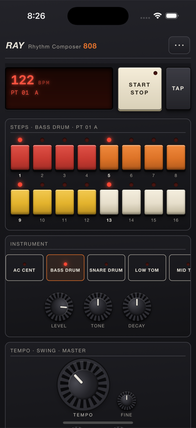
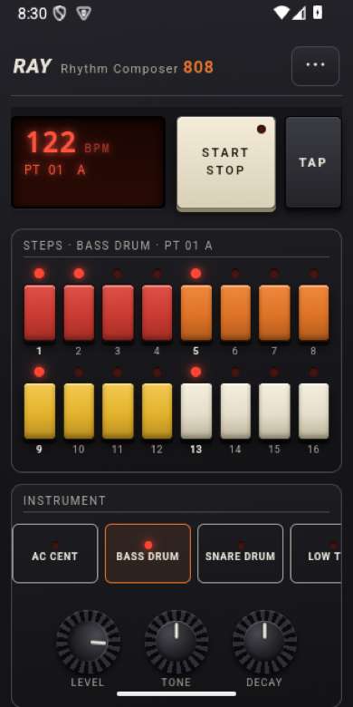
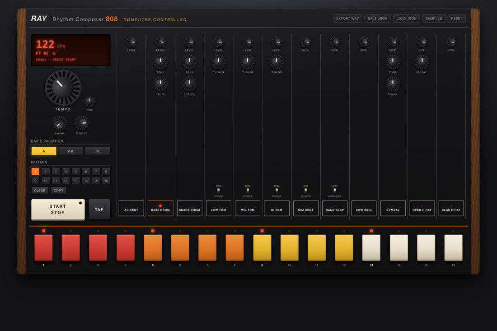
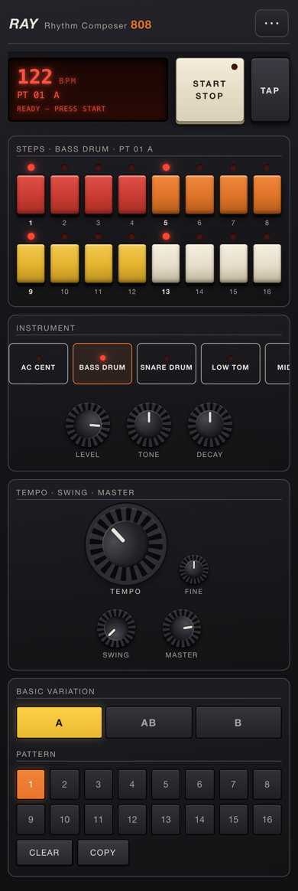

# Ray808

Caja de ritmos inspirada en la **Roland TR-808**, escrita en
[raylang](https://github.com/ray-language/raylang) + **React**, que corre como app de
**escritorio** (macOS, Linux, Windows) y de **teléfono** (iOS y Android) con el mismo fuente.
Suena con **samples reales** de una TR-808 (set de Michael Fischer, 1994) sobre Web Audio.

Es el port a React de la versión web en Vanilla JS (`labs/piano`) y la app de dogfood del
soporte de **frontends con Vite** de raylang: nació con `ray new ray808 --frontend react-ts`
(M263) y se empaqueta con `ray bundle`, `ray bundle --ios` y `ray bundle --android`.

<p>
  
  
</p>



## La máquina

- **16 voces / 12 channel strips**, como el hardware: Accent, Bass Drum, Snare, 3× Tom/Conga
  (switch), Rim Shot/Claves, Hand Clap/Maracas, Cow Bell, Cymbal, Open y Closed Hihat (con
  **choke** mutuo OH↔CH).
- **Knobs fieles**: el set de fábrica está muestreado en cada posición de los potenciómetros
  (ejes 00/10/25/50/75). Girar TONE/DECAY/SNAPPY elige el **sample real** de la matriz (el
  bombo tiene 25 grabaciones tone×decay); TUNING añade ajuste fino continuo.
- **Secuenciador de 16 pasos** con los colores icónicos, LED corredizo, fila de **accent**,
  **16 memorias de patrón**, variación **A / AB / B**, **swing**, CLEAR y COPY entre slots.
- **Transporte**: TEMPO (30–300 BPM) con FINE, TAP tempo, MASTER y compresor suave de bus.
- **Timing sólido**: scheduler con look-ahead sobre el reloj del AudioContext.
- **Samples propios** por voz (WAV/MP3/OGG), **EXPORT WAV** (render offline 16-bit/44.1 kHz)
  y **GUARDAR/CARGAR JSON** con el estado completo.

## Diseño para el teléfono

El panel de escritorio (12 columnas de knobs) es inservible en 390 px, así que por debajo de
760 px la app cambia de estructura, no solo de tamaño:

- **Cabecera fija** con el display y START/STOP + TAP, bajo la zona de la cámara y la barra
  de estado. Solo se desplaza el contenido de debajo: en iOS, un toque sobre una vista que
  aún se desliza por inercia solo la frena, así que un START dentro de la página desplazable
  se perdería. START y TAP actúan al presionar.
- **Los 16 pasos primero**, en **8 × 2** con botones del tamaño de un pulgar (38×52 px como
  mínimo), que se activan al **presionar** (no al soltar) para no perder golpes rápidos.
- **Tira de instrumentos** con scroll lateral (las placas serigrafiadas) y, debajo, los knobs
  **grandes** del instrumento elegido; tocar una placa lo selecciona y lo hace sonar.
- Tempo, swing y master, y después variación y memorias de patrón, con objetivos táctiles
  grandes.
- El menú de la barra de herramientas pasa a una **hoja de acciones** (⋯), el banco de sonidos
  ocupa la pantalla completa, y el RESET pregunta con un **diálogo propio**: los shells
  móviles no implementan `window.confirm`.
- Knobs táctiles: arrastre vertical con recorrido más corto para el dedo, doble toque para
  volver al valor por defecto, `touch-action: none` para no desplazar la página al girarlos.
- `viewport-fit=cover` y márgenes `safe-area` en iOS; en Android, cuyo WebView va de borde a
  borde sin informar insets, márgenes propios para la barra de estado y la de gestos.



## Arquitectura

```
┌──────────────────────── webview del sistema ───────────────────────┐
│  React (frontend/)                                                  │
│  Web Audio: engine · scheduler look-ahead · voces · render WAV      │
│      │ window.ray.request({op, …})               ▲ ui.reply(json)   │
└──────┼───────────────────────────────────────────┼──────────────────┘
       ▼                                           │
┌────────────── programa raylang (src/) ───────────┴──────────────────┐
│  main.ray      ventana (std/ui), bucle de eventos, menú About        │
│  api.ray       protocolo: hello, state.*, sample.*, export, import   │
│  store.ray     archivos: state.json, samples/<VOZ>.bin|.name, exports│
│  frontend.ray  servidor local: web.static_embedded + web.listen_local│
└──────────────────────────────────────────────────────────────────────┘
```

- **El audio vive en la página** (Web Audio es la API de audio del webview en las cinco
  plataformas); **los archivos viven en raylang**: el estado, los samples del usuario y las
  exportaciones pasan por el puente IPC de `std/ui` (`window.ray.request` → evento `message`
  → `api.handle` → `ui.reply`). Los bytes viajan en base64.
- **Diálogos nativos en escritorio**: EXPORT WAV/JSON abre `ui.save_file_with` y CARGAR JSON
  `ui.pick_file_with`. En el teléfono no hay diálogos: las exportaciones van a
  `Documents/Ray808/exports/` y la importación usa el selector de archivos del webview.
- **Datos**: `~/Documents/Ray808/` (macOS, Linux, iOS). En Android, el directorio privado de
  la app, `$HOME/Ray808/` = `/data/data/org.raylang.ray808/files/Ray808/` (el shell fija `HOME`
  desde raylang 1.27.13). Cada escritura va a un temporal y se
  renombra (atómica). Los ids de voz se validan contra las 16 del 808 antes de tocar una ruta.
- **Servidor local cerrado a la ventana**: los shells de iOS y Android cargan la URL que se les
  da y no atienden `ray://app`, así que la página se sirve siempre desde `127.0.0.1` con
  `web.listen_local`: token de 128 bits por arranque (`?ray_token=` y luego cookie) y guarda
  cross-site. Sin el token, cualquier otro proceso o página web recibe 403.
- **Fuera de la app** (un navegador con `npm run dev`) no hay `window.ray` y la página cae a
  `localStorage`, IndexedDB y descargas: el frontend sigue siendo una web completa.

## Uso

Las tareas habituales están en el `Makefile` (`make` las lista): `make dev` (escritorio con
hot reload), `make dev-device` (Vite en la red para el iPhone), `make test` (tests del backend,
lint, build y smoke), `make ios-lib` (recompila la librería del iPhone sin tocar el proyecto
Xcode), `make bundle-ios` / `make bundle-android` / `make bundle-macos`.

```bash
npm --prefix frontend install
ray dev                     # ventana nativa sobre el dev server de Vite (hot reload)
ray run                     # la build embebida (npm --prefix frontend run build antes)
```

| Tecla | Acción |
|---|---|
| `Espacio` | START/STOP |
| `A S D F G H J K L ; '` | dispara cada instrumento en vivo |
| `1–8` y `Q–I` | activa los pasos 1–16 |
| `←` / `→` | selecciona instrumento |
| Sobre un knob: arrastre vertical, rueda, doble clic, flechas | ajustar |

## Hot reload en el iPhone

`ray dev` no llega al teléfono, pero la página React sí puede recargarse en caliente en el
iPhone: el webview carga el dev server de Vite de tu Mac en vez de la build embebida, y
`window.ray` (que el shell inyecta en cualquier página) sigue hablando con el programa raylang
que corre en el teléfono.

1. En el Mac, con el iPhone en la misma red:
   ```bash
   npm --prefix frontend run dev:device    # Vite en 0.0.0.0:5173; imprime la URL "Network"
   ```
2. En Xcode, *Product → Scheme → Edit Scheme → Run → Arguments → Environment Variables*:
   activa `RAY808_DEV_URL` con esa URL (p. ej. `http://192.168.1.16:5173`) y ejecuta la app.
   La primera vez iOS pide permiso de red local.
3. Edita cualquier componente o CSS: el iPhone se actualiza al guardar.

Si el dev server no responde al arrancar (lo típico la primera vez: iOS aún está pidiendo el
permiso de red local y esas conexiones fallan), la app carga la build embebida, el display
muestra «WAITING FOR <ip>:5173…» y la página sigue llamando al dev server cada 1,5 s durante
2 minutos: en cuanto aceptas el permiso o arrancas Vite, salta sola a él. Nunca queda en
blanco.

El aviso de red local sale del `NSLocalNetworkUsageDescription` que declara `[app.plist]` en el
`ray.toml`: desde raylang 1.27.13 `ray bundle --ios` lo escribe en `Ray808-ios/Shell/Info.plist`
(antes había que añadirlo a mano con `plutil`). Sin la variable (o desactivada) se comporta como
siempre. El hot reload cubre el frontend; un cambio en `src/*.ray` sigue pidiendo recompilar la
librería (abajo) e instalar de nuevo.

`ray bundle --ios` reescribe `Ray808.xcodeproj` entero, **incluido el esquema compartido** donde
vive `RAY808_DEV_URL`: `make bundle-ios` guarda `xcshareddata/` antes y lo repone después.

**Alternativa de raylang (1.27.13): `RAY_DEV_FRONTEND_URL`.** Una librería compilada con
`--devtools` (`ray build --native --lib --devtools …`, sin `--release`) honra esa variable si el
dev server responde al arrancar y, si no, usa la build embebida; `ui.app_url` cambia entonces el
origen del servidor local por el de Vite. En el simulador funciona igual que `RAY808_DEV_URL`
(página desde Vite, `window.ray` hablando con el programa del teléfono, respaldo con Vite
apagado). Ray808 se queda con `RAY808_DEV_URL` porque raylang decide una sola vez, al arrancar: la
primera vez que iOS pide el permiso de red local (y esas conexiones fallan) se quedaría en la
build embebida, mientras que la página de Ray808 sigue llamando al dev server y
salta a él en cuanto responde; además funciona con la librería `--release` de siempre.

## Empaquetar

```bash
ray bundle                                   # macOS: Ray808.app (icono y About del [app])
ray bundle --ios                             # proyecto Xcode en Ray808-ios/ (iPhone + simulador)
(cd Ray808-ios && xcodebuild -project Ray808.xcodeproj -target Ray808 \
   -sdk iphonesimulator -configuration Debug build CODE_SIGNING_ALLOWED=NO)
ray bundle --android --android-abi arm64     # proyecto Gradle en Ray808-android/
(cd Ray808-android && gradle assembleDebug)  # app/build/outputs/apk/debug/app-debug.apk
```

Los proyectos generados no se versionan: se crean una vez con `ray bundle`. Después, un cambio
en el frontend o en el programa raylang **no pide regenerar el proyecto**: la página va
embebida en la librería estática, así que basta recompilarla (corre el build de Vite y deja
intactos `project.pbxproj`, `App.xcconfig` y la firma):

```bash
ray build --native --lib --release --target aarch64-apple-ios     -o Ray808-ios/libs/libray_app.a      # iPhone
ray build --native --lib --release --target aarch64-apple-ios-sim -o Ray808-ios/libs-sim/libray_app.a  # simulador
```

y compilar de nuevo en Xcode (`make ios-libs`). `ray bundle --ios` solo hace falta si cambia el
`[app]` del `ray.toml` (nombre, id, icono, `[app.plist]`) o la versión de raylang trae un shell
nuevo. `--ios-target sim` acelera la iteración en el simulador, pero en un proyecto nuevo lo deja
**sin la librería de dispositivo** (`libs/libray_app.a`; desde 1.27.13 el bundle lo avisa):
compilar para un iPhone desde Xcode falla con «Library 'ray_app' not found» hasta regenerar con
`ray bundle --ios` (ambos destinos, el valor por defecto).

Para un iPhone real, pon tu equipo en `Ray808-ios/App.xcconfig` (`CODE_SIGN_STYLE = Automatic`
y `DEVELOPMENT_TEAM = <tu Team ID>`), o en `[ios] development_team` del `ray.toml`: `ray bundle
--ios` conserva ese archivo al regenerar. Si lo eliges en la pestaña *Signing & Capabilities*
de Xcode, Xcode lo guarda en `project.pbxproj`, que se regenera entero; desde raylang 1.27.13 el
bundle lo rescata de ahí y lo pasa a `App.xcconfig`, pero la fuente de verdad sigue siendo el
xcconfig (el Team ID no va al `ray.toml` de un repo público). El icono sale de
`assets/icon.png` (`node frontend/scripts/make-icon.mjs` lo regenera).

## Estado

| Qué | Verificado |
|---|---|
| Backend raylang | `ray test` y `ray test --native`: 15 tests (estado, samples, exportación, diálogos cancelados, rutas hostiles, directorio de datos, URLs del dev server) |
| Frontend | `npm run build` (TypeScript estricto) + `npm run smoke`: 20 comprobaciones en Chrome headless, escritorio 1440×960 y teléfono 390×844 táctil (carga de los 116 samples, LED corredizo, knobs, pasos, patrones, guardado por el puente, sin scroll lateral, hoja de acciones, banco de sonidos, diálogo de RESET) |
| Programa completo | `ray run` headless: el servidor local da 200 con token, 403 sin token y 403 cross-site |
| macOS | `ray bundle` → `Ray808.app` (16 MB) sirviendo los assets embebidos con `cwd=/` |
| iOS | simulador iPhone 16 Pro: arranca, carga los samples y responde por el puente en < 3 s (un `state.json` sembrado aparece en el display); con raylang 1.27.13 también con `RAY_DEV_FRONTEND_URL`, con Vite encendido y apagado |
| Android | emulador arm64: arranca, y un paso tocado con `adb` queda en `state.json` del backend y sobrevive al reinicio; con raylang 1.27.13 el estado vive bajo el `HOME` que fija el shell, y CARGAR JSON abre el selector de archivos del sistema e importa el archivo elegido |

Sin verificar en dispositivo real: el sonido en sí (los emuladores no se escucharon), y en
iOS el interruptor de silencio, que también silencia Web Audio.

## Limitaciones conocidas

- **Android: las exportaciones quedan en el directorio privado de la app** (no hay diálogo de
  guardar; el selector de archivos para cargar sí funciona desde raylang 1.27.13).
- **iOS: el interruptor de silencio silencia la app** (categoría de audio por defecto de
  WKWebView; cambiarla es trabajo del shell).
- Drag & drop de samples solo en escritorio.

## Hallazgos de dogfood

Hallazgos sobre raylang que salieron de construir la app (propuestos, no escritos en raylang),
con su estado en raylang 1.27.13:

1. **`ui.reply` no resuelve la Promise en los shells móviles.** iOS y Android entregan los
   mensajes de la página con `window = 0` (el shell no conoce el handle), pero
   `ui.reply(0, …)` busca la ventana 0 en el mapa del runtime, falla con «not an open window»
   y `window.ray.request` queda colgada para siempre. La app contesta a su única ventana
   cuando llega un 0 (`src/main.ray`). Propuesta: que el runtime trate `0` como «la ventana del
   shell» en `eval_js`/`reply`, o que el shell entregue el handle real. **1.27.13: sigue roto
   en nativo**: el CHANGELOG lo da por resuelto, pero en el simulador, sin el rodeo, cada
   respuesta falla con `ray808: reply: ui: not an open window` y el estado guardado no llega a
   la página. El rodeo se queda.
2. **Los shells móviles no atienden `ray://app`**: la plantilla de `ray new --frontend` abre
   `app://index.html` (→ `ray://app/…` fuera de `ray dev`), que en iOS/Android no carga. Una
   app móvil necesita el servidor local; la documentación de M263 no lo dice. **1.27.13:
   documentado** en el MANUAL; los shells siguen sin servir el esquema.
3. **Android no da un directorio de datos**: el shell no define `HOME` y corre con `cwd=/`.
   La app deducía `/data/data/<paquete>/files` de `/proc/self/cmdline`. **Resuelto en
   1.27.13**: el shell fija `HOME`/`TMPDIR` y `store.ray` usa `$HOME/Ray808`.
4. **Android: sin `onShowFileChooser`** en el `WebChromeClient` del shell → `<input
   type="file">` no hacía nada. **Resuelto en 1.27.13.**
5. **`ray add` coloca la dependencia debajo del comentario de la sección siguiente** (el de
   `[frontend]` que genera `ray new --frontend`), separándolo de su tabla.
6. **`ray fmt`** junta en una línea un literal de struct cuyos campos son closures (ilegible) y
   no parte una constante de arreglo de 122 columnas.
7. **`assert_eq` sobre `Option`/`Result` no compilaba** (`Option<int> does not implement
   'Eq'`). **Resuelto en 1.27.13**: los tests comparan `Option`/`Result` directamente.
8. `match` no aceptaba patrones literales de string (`"hello" => …`). **Resuelto en 1.27.13**:
   el despachador del protocolo (`api.ray`) es un `match` sobre `op`.
9. **`ray bundle --ios` borra el esquema compartido de Xcode** (1.27.13): regenera
   `Ray808.xcodeproj` entero, así que `xcshareddata/xcschemes/Ray808.xcscheme` — donde vive
   `RAY808_DEV_URL` — desaparece. Los ids del pbxproj son fijos, así que `make bundle-ios` lo
   guarda y lo repone. Propuesta: preservar `xcshareddata/` (y `xcuserdata/`) al regenerar, como
   ya se preservan la firma y las librerías.
10. **`ray fmt` saca de la lista un comentario sobre su último elemento** (1.27.13): un
   `// …` justo antes del último elemento de un literal de arreglo acaba después del `]`.

## Créditos y licencia de los samples

Banco de fábrica: **TR-808 muestreada por Michael Fischer (1994)**, de libre distribución
(ver `frontend/public/samples/808/808/TR808.TXT`), obtenida del repositorio
[tidalcycles/Dirt-Samples](https://github.com/tidalcycles/Dirt-Samples). Roland y TR-808 son
marcas de Roland Corporation; este proyecto es un homenaje educativo sin afiliación.
